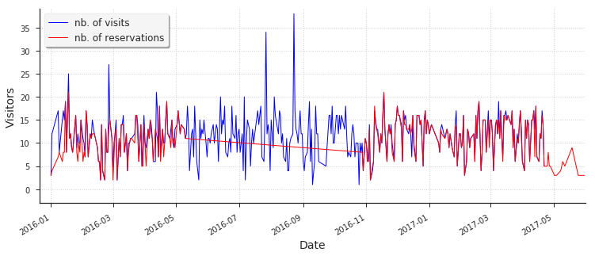
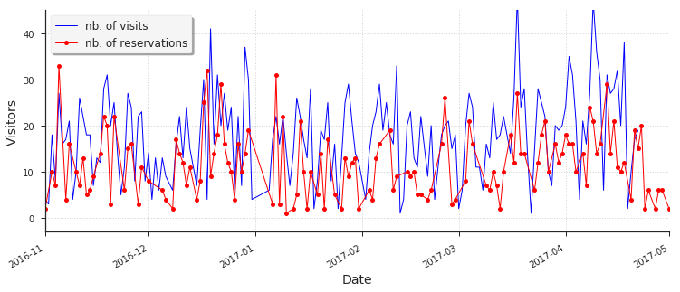
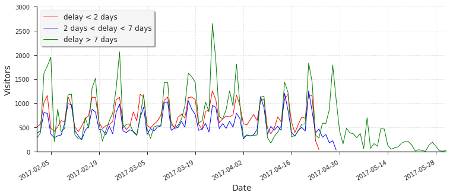

## Visitor Forecasting (Recruit Holdings)
**Competition Description:**  
Running a thriving local restaurant isn't always as charming as first impressions appear. There are often all sorts of unexpected troubles popping up that could hurt business.

One common predicament is that restaurants need to know how many customers to expect each day to effectively purchase ingredients and schedule staff members. This forecast isn't easy to make because many unpredictable factors affect restaurant attendance, like weather and local competition. It's even harder for newer restaurants with little historical data.

Recruit Holdings has unique access to key datasets that could make automated future customer prediction possible. Specifically, Recruit Holdings owns Hot Pepper Gourmet (a restaurant review service), AirREGI (a restaurant point of sales service), and Restaurant Board (reservation log management software).

In this competition, you're challenged to use reservation and visitation data to predict the total number of visitors to a restaurant for future dates. This information will help restaurants be much more efficient and allow them to focus on creating an enjoyable dining experience for their customers.

For the hpg_reserve data, follow this <a href="https://www.kaggle.com/c/recruit-restaurant-visitor-forecasting/data">link</a>  

### Snapshot of the data:  

**Location of the restaurants featured in the competition:**  

One thing to keep in mind is that these locations are only an approximation of the actual geolocations in order to keep the data anonymous.  

<kbd></kbd>  

**Number of Visits vs Reservations:**  

*Few things to note:*  
1. The number of reservations only account for a fraction of the number of visits since most people would visit a restaurant without making
a reservation beforehand.  
2. Also, there a quite a few high frequency periods which probably arise due to day of the week since it seems logical for the common public to flock restaurant
chains during the weekend/friday instead of a weekday.  

<kbd></kbd>  

**Scenario 1: When Reservations equals Visits (the ideal case):**  

Contrary to when we were considering all the restaurants, the number of reservations vs visits in this case **(this observation is for 1 specific restaurant)** closely follow one another. This data probably corresponds to a high end restaurant since for the most part, they only serve customers who have made a prior reservation.  

<kbd></kbd>  

**Scenario 2: When Reservations lag behind Visits (probably the more common case):**  

Picking a second restaurant and zooming in on the data between Nov 2016 to May 2017 reveals this interesting plot where the number of visits is more than the number of reservations. This, in my opinion is probably the more common case since most mid-low tier restaurants don't really bother much with prior reservations and will serve almost anyone. On the other hand, most high end restaurants will only serve customers who have previously made a reservation, as depicted by the preceding graph. 

<kbd></kbd>  

*Predicting future visitors for high end restaurants will be the easy part, the challege will be in predicting future visitors for low-mid tier restaurants and for that we might even have to use external data (such as weather data) if the competition rules allow it.*  

**Test set Reservations:**  

We can see that after April 22, the number of reservations starts to decline with time and after a few days, we don't have any information regarding the reservations made 2 days before the visit. In fact, after April 29, we don't have any info on the reservations made 7 days before the visit. Long term reservations are available for the test set, however their number tends to decrease with time.  

<kbd></kbd>  

**Conclusions:**  

The above observations might be crucial to making predictions in the test set since the public leaderboard would correspond to April 23rd - April 28th period, for which we still have some info concerning the number of reservations. If we take number of reservations into account, then our model should perform reasonably well on the public leaderboard. However after April 28, there's a severe lack of info on the number of reservations and our models should take this into consideration as well, otherwise it will perform decently on the public leaderboard and poorly on the private leaderboard.  

Note: Open the images in a new tab if the axes are not visible in github's dark theme.  

### Results:  
**Final Rank:** 207/2148 (top 10%)  
**Private Leaderboard RMSLE Score:** 0.51817  
**Winning Solution Private Leaderboard RMSLE Score:** 0.50128  
